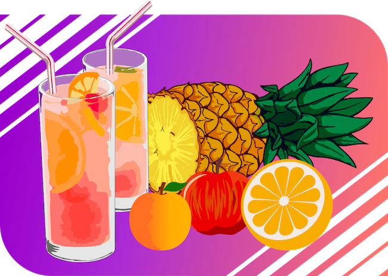

# TROPICAL PUNCH
<!-- ALL-CONTRIBUTORS-BADGE:START - Do not remove or modify this section -->

<!-- ALL-CONTRIBUTORS-BADGE:END -->

## Training

[Codewars](codewars.md)

## Classic times

## Contributors ✨

Thanks goes to these wonderful people ([emoji key](https://allcontributors.org/docs/en/emoji-key)):

<!-- ALL-CONTRIBUTORS-LIST:START - Do not remove or modify this section -->
<!-- prettier-ignore-start -->
<!-- markdownlint-disable -->
<table>
  <tr>
    <td align="center"><a href="https://github.com/jbampton"> <b>John Bampton</b></a> <a href="https://github.com/slurpcode/tropical-punch/commits?author=jbampton" title="Documentation">📖</a> <a href="#business-jbampton" title="Business development">💼</a> <a href="#ideas-jbampton" title="Ideas, Planning, & Feedback">🤔</a> <a href="#projectManagement-jbampton" title="Project Management">📆</a></td>
    <td align="center"><a href="https://allcontributors.org"> <b>All Contributors</b></a> <a href="https://github.com/slurpcode/tropical-punch/commits?author=all-contributors" title="Documentation">📖</a> <a href="#projectManagement-all-contributors" title="Project Management">📆</a></td>
    <td align="center"><a href="http://andrew-colman.com"> <b>Andrew </b></a> <a href="https://github.com/slurpcode/tropical-punch/commits?author=Andrew-Colman" title="Documentation">📖</a></td>
    <td align="center"><a href="https://github.com/summerhill5"> <b>Jorge Araica</b></a> <a href="#design-summerhill5" title="Design">🎨</a> <a href="#ideas-summerhill5" title="Ideas, Planning, & Feedback">🤔</a></td>
  </tr>
</table>

<!-- markdownlint-restore -->
<!-- prettier-ignore-end -->

<!-- ALL-CONTRIBUTORS-LIST:END -->

This project follows the [all-contributors](https://github.com/all-contributors/all-contributors) specification. Contributions of any kind welcome!